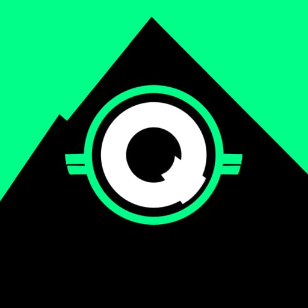

  

# Questify 🛡️🎮

**Questify** est un projet personnel à long terme visant à transformer la productivité en aventure. Grâce à une interface gamifiée et motivante, l’utilisateur devient le héros de sa propre progression. C'est un outil de gamification. 

## 🚀 Objectif du projet

Questify a pour but d’aider les utilisateurs à rester disciplinés, concentrés et réguliers dans leurs objectifs quotidiens ou professionnels, en s’appuyant sur des mécaniques issues des jeux vidéo :
- quêtes,
- niveaux,
- récompenses,
- badges,
- et autres éléments de progression.

L’idée : **rendre le travail quotidien motivant, immersif, et gratifiant.**

## 🔧 Fonctionnalités prévues

Le projet est en développement actif, mais voici les fonctionnalités prévues pour le MVP (Minimum Viable Product) :

- ✅ Création de quêtes personnalisées (tâches à accomplir)
- 🎯 Système de récompenses (XP, niveaux, pièces…)
- 📊 Suivi de la progression (historique, taux de réussite…)
- 🧩 Statistiques journalières/hebdomadaires
- 🎨 Interface simple et motivante (UI desktop)

## 🛠️ Technologies utilisées

- **Python** : langage principal
- **Interface Desktop** : à définir selon les besoins (Tkinter, PyQt, Kivy…)
- Stockage local (JSON ou SQLite pour le MVP)

## 📆 Délai

Questify est un projet **à long terme**, développé **entièrement en solo** avec un budget limité.  
L’objectif est de livrer un **MVP fonctionnel d’ici fin mai 2025**.

## 💡 Vision à long terme

Une fois le MVP validé, Questify pourra être :
- enrichi de nouvelles mécaniques de jeu (objets, avatars, monde à explorer…),
- adapté à d’autres plateformes (Android, Web...),
- et potentiellement ouvert à une communauté d’utilisateurs ou de contributeurs.

## 🤝 Contribution

Pour l’instant, ce projet est **non-collaboratif** (développement solo), mais toute suggestion, retour ou encouragement est **le bienvenu**.
Le logo a été designé par un proche (N.I). 

---

> Ce projet est bien plus qu’un logiciel : c’est un outil pour construire la version la plus disciplinée et puissante de soi-même.

